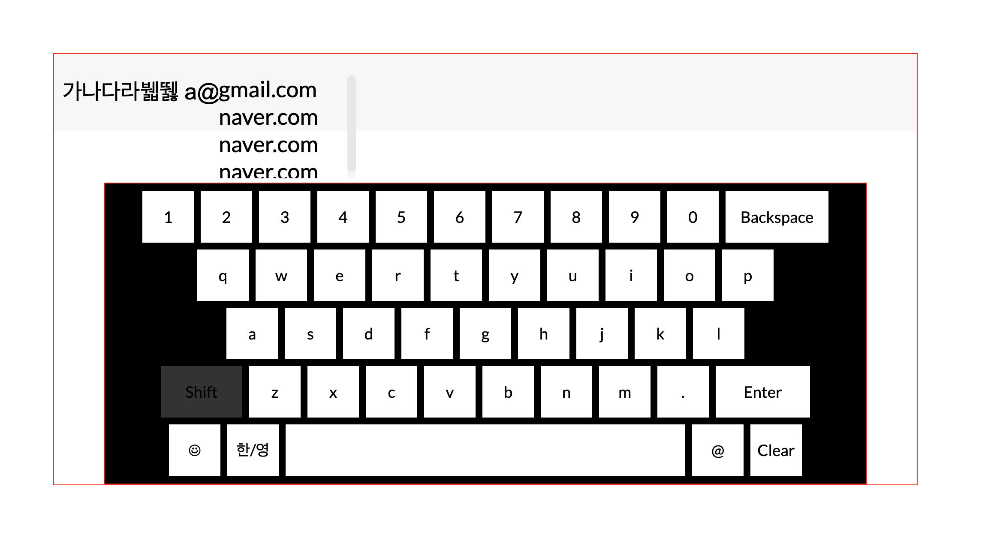

# Virtual Keyboard

**hangul.js** 라이브러리를 활용하여 구현한 **한/영 및 특수문자 지원 가상 키보드**입니다.  
클릭 & 터치 방식으로 입력이 가능하며, **이메일 자동완성 기능**도 포함되어 있습니다.

## 특징

- **한글 & 영어 입력 지원** (`hangul.js` 활용)
- **클릭 및 터치 입력 방식 지원** (모바일 / kiosk 환경 대응)
- **이메일 자동완성 기능 구현**
- **특수문자 입력 지원**

## 사용된 기술

- **JavaScript**
- **hangul.js 라이브러리** (한글 입력 처리)
- **HTML / CSS** (키보드 UI 및 스타일링)
